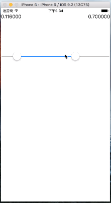

# DoubleThumbSlider

A slider with two thumbs.

双滑块控件

## Warning ！！

[Refused by Apple](https://github.com/Magic-Unique/DoubleThumbSlider/issues/1)

DTSlider use private APIs of UISlider class, It will cause your App refused by App Store. 

DTSlider 用到了 UISlider 类中的私有 API，这将会导致你的 App 会被拒绝上传至 App Store。

## Preview 效果图



## USAGE 使用方式

### CocoaPods

```ruby
pod 'DTSlider'
```

### Source

drag *DTSlider* folder into your project.

### Import

```objc
#import "DTSlider.h"
```

```objc
// DTSlider.h

@interface DTSlider : UISlider

@property (nonatomic, assign) float maxValue;

@property (nonatomic, assign) float minValue;

- (void)setMinValue:(float)minValue animated:(BOOL)animated;
- (void)setMaxValue:(float)maxValue animated:(BOOL)animated;
- (void)setMinValue:(float)minValue maxValue:(float)maxValue animated:(BOOL)animated;

@end
```

### Create Instance

```objective-c
// in the other file.
DTSlider *slider = [[DTSlider alloc] init];
slider.maxValue = 100.0;	//	init value
slider.minValue = 0.0;		//	init value
[slider addTarget:self action:@selector(sender:event:) forControlEvents:UIControlEventValueChanged];

// selector
- (void)sender:(DTSlider *)sender event:(UIControlEvent)event {
	NSLog(@"min value:%f\nmax value:%f\n", sender.minValue, sender.maxValue);
}

//	set value without animation
slider.maxValue = 100.0;
slider.minValue = 0.0;

// set value with animation
[slider setMaxValue:100.0 animated:YES];
[slider setMinValue:1.0 animated:YES];
```


You can use the component like UISlider, and set the value with `minValue` and `maxValue` properties. In the mean time, you can also set target-action to touch the event of value changing, call getters of the properties to get new value. The `value` property of super-class is the value which changed by user, it means that `value` will equal to `minValue` or `maxValue`.

使用方式类似系统自带的 UISlider，可以通过 `minValue` 和 `maxValue` 来设置控件的值。同时，可以通过设置 target-action 的方式来监听 ValueChanged 事件，并且通过这两个属性来获取到新的值。父类中的 `value` 属性代表着用户变化的那个值，这意味着 `value` 属性可能等于 `maxValue` 也可能等于 `minValue` 。

## LICENSE

MIT.
