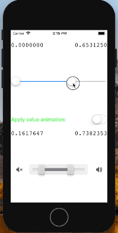

# DoubleThumbSlider

A slider with two thumbs.

双滑块控件

## PREVIEW 效果图



## USAGE 使用方式

```objc
// MUDoubleThumbSlider.h

@interface MUDoubleThumbSlider : UISlider

/** 滑块小值 */
@property (nonatomic, assign) CGFloat maxValue;

/** 滑块大值 */
@property (nonatomic, assign) CGFloat minValue;

@end
```

```objective-c
// in the other file.
MUDoubleThumbSlider *slider = [[MUDoubleThumbSlider alloc] init];
slider.maxValue = 100.0;
slider.minValue = 0.0;
[slider addTarget:self action:@selector(sender:event:) forControlEvents:UIControlEventValueChanged];

// selector
- (void)sender:(MUDoubleThumbSlider *)sender event:(UIControlEvent)event {
	NSLog(@"min value:%f\nmax value:%f\n", sender.minValue, sender.maxValue);
}
```


You can use the component like UISlider, and set the value with `minValue` and `maxValue` properties. In the mean time, you can also set target-action to touch the event of changing value, use the two properties to get new value. The `value` property of super-class is the value which changed by user, it means that `value` will equal to `minValue` or `maxValue`.

使用方式类似系统自带的 UISlider，可以通过 `minValue` 和 `maxValue` 来设置控件的值。同时，可以通过设置 target-action 的方式来监听 ValueChanged 事件，并且通过这两个属性来获取到新的值。父类中的 `value` 属性代表着用户变化的那个值，这意味着 `value` 属性可能等于 `maxValue` 也可能等于 `minValue` 。